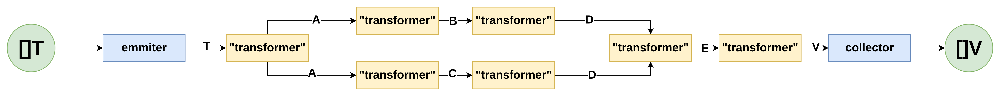

## Pipeline
Implements pipeline pattern in generic way. Each pipeleine is splited to separate stages that receives input type and produces output type. The ouptput is passed to the nest stage and so on. There are 2 specific stages: emitter stage - first stage that receives input slice and produces elements to a channel of other stages next to the first one; collector stage - the last stage of each pipeline that collects all elements that passed trough pipelelin to a slice and returns transfromd elements to the client code.

In general pipeline could look like:



Here T, A, B C, D, E, V - different go types that are pessed from stage to stage. It's not obligatory to use different types, you can always use the same type for different stages, up to developer.

### Stages

#### Transformer

The type of stage can be built using function type `func(context.Context, In) (Out, error)`. The idea of the stage is to make some calculation/produce ne type/fill some fields of `In` type

#### Filter
The type of stage can be build using function type `func(context.Context, In) (bool, error)`. The idea is to filter out some elements from stream. If the function returns true the element goes forward, otherwise it is excluded from stream.

#### Flatter
The type of stage can be built using function type `func(context.Context, In) ([]Out, error)`. The idea of the stage is to split one `In` element to a slice of elements of another type and send it one by one to a fether stages.

#### Aggregator
The type of stage can be built using function type `func(context.Context, In) (K(comparable), error)`. The idea of the stage is to collect elements by keys that are calulated by `In` type. Next stage should be implemented within producd type of the aggregator stage: `pipeline.AggregatedPair[K comparable, V any]`. The `AggregatedPair` is an interface that has 2 methods: `Key() K` and `Values() []V`


### Usage

Lets say, we have a sintetic task: For integer slice we have to take even values, multiply it to 2 and doblicate each element, than we could build next pipeline:

```go

import (
	"context"
	"fmt"

	"github.com/YReshetko/pipeline"
)

func main() {
	p := pipeline.New([]int{1, 2, 3, 4})
	p = pipeline.Filter(p, func(_ context.Context, v int) (bool, error) { return v%2 == 0, nil })
	p = pipeline.Transformer(p, func(_ context.Context, v int) (int, error) {return v*2, nil})
	p = pipeline.Flatter(p, func(_ context.Context, v int) ([]int, error) {return []int{v, v}, nil})
	v, _ := p.Run(context.Background())
	fmt.Println(v)// 4 4 8 8 
}
```

For this simple example it's doesnt required to handle errors, but imaging that on each stage of your transformation you have to handle errors, but using piplines it will be done for you inside the processing and if everything is file you recive result without errors, but if some elements on some stage returns an error the pipeline will be closed and on `Run()` you will get the error that contains stage name
